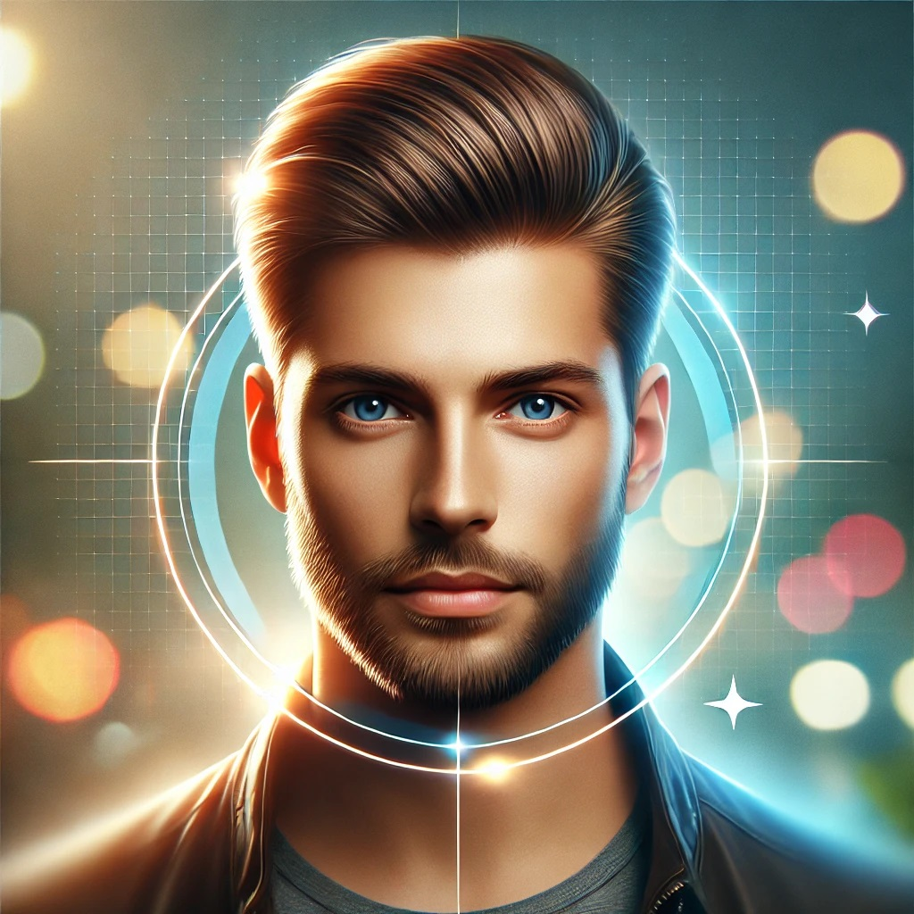

# _CRAZY CODE_
## **About me**
Привет! Меня зовут __Дмитрий__!

С детства мечтал глубоко связать свою жизнь  с IT. В "нулевых" с большим азартом гонялся за такими изданиями как "Мир ПК", "Хакер" и т.п. Работал сборщиком системных блоков с первоначальной настройкой. Но обучение в институте на кафедре ИИТ была скучной и отдаленно напоминала интересующее меня направление деятельности. 

До последнего момента получалось только _*"плавать на поверхности"*_.
Благодаря появившимся инструментам обучения, как Нетология и т.п. погружаться в глубины _*"цифры"*_ стало увлекательнее и легче!
В каком то смысле именно благодаря таким инструментам сбываются давние мечты.

